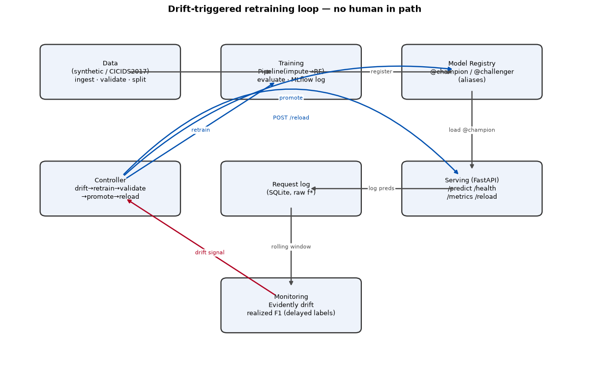
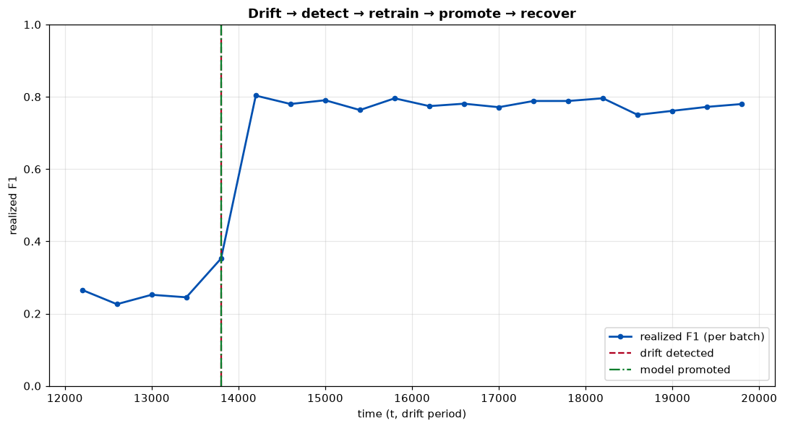

# mlops-drift-retrain

An end-to-end MLOps platform that trains a network-intrusion classifier, **detects data drift in
production, auto-retrains, validates the challenger against the champion, and promotes only if it
wins — then hot-reloads serving.** A closed loop with no human in the path. The deliverable is the
*system* and its honest, reproducible evaluation — not model accuracy.



## The result

When the production distribution shifts (a new attack sub-population the champion has never seen),
realized F1 collapses — then the loop detects the drift, retrains, promotes a better model, and
recovers, automatically:



Stale champion on drift ≈ **0.27 F1** → after auto-promotion ≈ **0.78 F1**. Reproduce with
`make experiment`.

## Quickstart

```bash
uv sync --extra dev          # Python 3.12 env + deps
make train                   # train + register the champion (MLflow, sqlite-backed)
make up                      # serve the champion (uvicorn) on :8000
make smoke                   # POST a sample → 200 + valid prediction
make monitor                 # one-shot drift + realized-perf report
make experiment              # full loop end-to-end → docs/images/drift_recovery.png
make test                    # 54 tests
```

No Docker/cluster needed for the quickstart — everything runs as local processes. The same
code also runs containerized in Docker Compose and on minikube (see *Deploy* below).

## How it works

1. **Serve** — `@champion` answers `POST /predict`; every request is logged to SQLite.
2. **Monitor** — a rolling window of served features is compared to the persisted reference
   window with Evidently → a **label-free** drift signal (`monitoring/drift.py`).
3. **Detect** — the controller polls the signal; a breach (debounced by a cooldown) triggers a
   retrain (`controller/loop.py`).
4. **Retrain** — in-process training on `reference + drift` so the challenger learns the new
   sub-population; registered as `@challenger` (`training/train.py`).
5. **Validate & promote** — challenger vs champion on a common holdout; promote **iff**
   `Δf1 ≥ f1_margin` **and** `f1 ≥ f1_floor`; the `@champion` alias moves atomically
   (`promotion/champion_challenger.py`). Never on tie/regression.
6. **Reload** — the controller `POST /reload`s serving, which hot-swaps the new champion. Loop.

See [`docs/architecture.md`](docs/architecture.md) and the experiment writeup
[`experiments/drift_experiment.md`](experiments/drift_experiment.md).

## Key design decisions

- **Registry aliases, not stages** — `@champion`/`@challenger` (MLflow ≥ 2.9 deprecated stages).
- **Time-aware splits, no leakage** — train on earlier rows, evaluate on later; asserted in tests.
  `t`/`period`/`label` are never features.
- **Label-free drift trigger, delayed-label realized perf** — the loop triggers on a signal that
  needs no labels (they arrive late); realized F1 is computed separately for honest evaluation.
- **Imbalanced metrics** — F1 + PR-AUC primary, never accuracy alone.
- **Config-driven** — every path/threshold/hyperparameter lives in `configs/`; no magic numbers.
- **Reproducible** — fixed seed; every run logs the DVC data hash + git SHA + params + the
  reference window; `dvc repro` reproduces data→train.

## Tech stack
Python 3.12 · `uv` · scikit-learn · MLflow (tracking + registry, sqlite-backed) · Evidently ·
FastAPI + uvicorn · prometheus-client · pandera · pydantic-settings · structlog · DVC · ruff ·
pytest.

## Deploy
The same image (one build, four entrypoints — train / serve / monitor / controller) runs the
whole loop in containers. Full runbook: [`docs/deploy.md`](docs/deploy.md).

**Docker Compose** — prove the loop locally:
```bash
cd deploy/docker
docker compose up --build        # seed trains @champion, then serving + controller + prom + grafana
curl localhost:8000/health       # 200
docker compose exec controller make replay   # drive drift -> retrain -> promote -> reload
# Grafana localhost:3000 (anon admin): "Drift & Retrain" -> realized_f1 dips then recovers
```

**Minikube** — the real target, monitored by kube-prometheus-stack:
```bash
eval $(minikube docker-env)
docker build -f deploy/docker/serving.Dockerfile -t mlops-drift:local .
helm install kps prometheus-community/kube-prometheus-stack -n monitoring --create-namespace \
  --set prometheus.prometheusSpec.serviceMonitorSelectorNilUsesHelmValues=false
kubectl apply -f deploy/k8s/        # ns, pvc, seed Job, serving, controller, ServiceMonitors, dashboards
kubectl -n mlops wait --for=condition=complete job/seed-train --timeout=300s
```
Both serving (`:8000`) and the controller's monitor registry (`:9100`) are scraped via
ServiceMonitors; the serving + drift dashboards are provisioned as labeled ConfigMaps.

**Live (public)** — for a shareable Grafana link: [`docs/deploy-vm.md`](docs/deploy-vm.md) runs
the compose stack on a single Always-Free VM (simplest), or [`docs/deploy-oke.md`](docs/deploy-oke.md)
runs it on Oracle OKE's managed ARM tier (`deploy/k8s/oke/` + `deploy/helm/kps-values-oke.yaml`).

The drift dataset is **synthetic** (auto-swapped for real CICIDS2017 if CSVs are dropped in
`data/raw/`). Any local-mode fallback is recorded in [`CHANGELOG.md`](CHANGELOG.md).

## What I learned
Coming from a DevOps background, I expected the infrastructure side of this project to be
the hard part. It wasn't — Kubernetes manifests and CI pipelines are familiar territory.
The hard part was understanding *why* a deployed model silently degrades in a way that
deployed software doesn't. Code doesn't rot; models do, because the world they learned
from keeps changing underneath them. That distinction — between software correctness and
model correctness — is what this project taught me.

The drift threshold tuning surprised me the most. Set it too tight and the system
thrashes, retraining on noise every few hours. Set it too loose and it takes so long to
react that users have already been served bad predictions for days. I ended up picking a
threshold that's deliberately conservative (fewer false retrains) and adding a cooldown
timer, which felt like the right engineering tradeoff — but I'd love to explore adaptive
thresholds in future work.

The other thing I didn't expect: how much the *evaluation* matters compared to the model
itself. The RandomForest classifier took an afternoon to get working. The honest
evaluation pipeline — time-aware splits, label-free drift signals, realized-F1 tracking,
champion/challenger validation — took weeks. That ratio is probably what real ML
engineering looks like, and it's the part I'm most glad I invested in.

## Limitations & future work
- Synthetic data with an engineered (detectable) shift; the promotion holdout overlaps retrain
  data (optimistic) — the honest view is the per-batch realized-F1 series.
- Realized F1 lags by the label delay in production (revealed immediately only for the plot).
- Single SQLite writer + in-process model swap assume one serving worker.
- **Single node only.** SQLite + in-process model swap + a ReadWriteOnce PVC mean exactly one
  serving worker on one node — correct for this demo, not for scale. The scale-out path is
  MLflow on Postgres + S3/MinIO, then serving goes `replicas: N` and retrain becomes a K8s Job.
- **Future work:** real CICIDS2017 ingest; a disjoint future holdout for promotion; a feature
  store; multi-worker serving with a shared model cache; concept-drift (not just covariate-drift)
  detection.

## Layout
```
src/mlops_drift/{data,training,serving,monitoring,promotion,controller,experiments,utils}
configs/   config.yaml + thresholds.yaml      # all knobs
deploy/    docker/ k8s/ prometheus/ grafana/  # compose + minikube stack (see docs/deploy.md)
pipelines/ replay.py        experiments/ drift_experiment.md       docs/ architecture.md
tests/     54 tests                           .github/workflows/    ci.yml + retrain.yml
```
